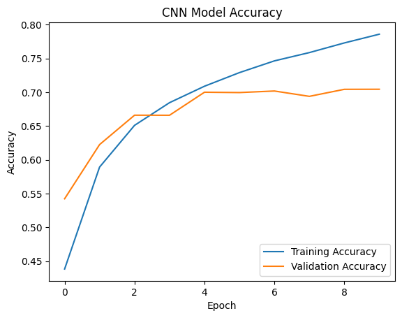

# CODTECH IT SOLUTIONS MACHINE LEARNING INTERNSHIP

## TASK 3: IMAGE CLASSIFICATION MODEL

### Project Overview
This project involves building a **Convolutional Neural Network (CNN)** to classify images into ten distinct categories using the CIFAR-10 dataset.

### Task Details
* **Organization**: CODTECH IT SOLUTIONS
* **Intern Name**: Purvi Ganvir
* **Intern ID**: CTIS6235
* **Domain**: Machine Learning
* **Duration**: 17th Feb to 17th March
* **Mentor**: Muzzamail

### Technical Roadmap
1.  **Data Acquisition**: Utilized the CIFAR-10 dataset consisting of 60,000 32x32 color images.
2.  **Preprocessing**: Normalized pixel values and prepared labels for the neural network.
3.  **Model Architecture**: Designed a CNN with multiple convolutional and pooling layers to extract spatial features from images.
4.  **Training**: Compiled the model with the Adam optimizer and trained it over 10 epochs.
5.  **Evaluation**: Validated the model on a test dataset to measure accuracy and loss performance.

---

### Model Performance
Below is the accuracy plot generated during the training phase:

---

### Tools & Technologies Used
* **Python**: Core programming language.
* **TensorFlow/Keras**: For building and training the CNN.
* **Matplotlib**: For visualizing training history.
* **NumPy**: For numerical operations.
